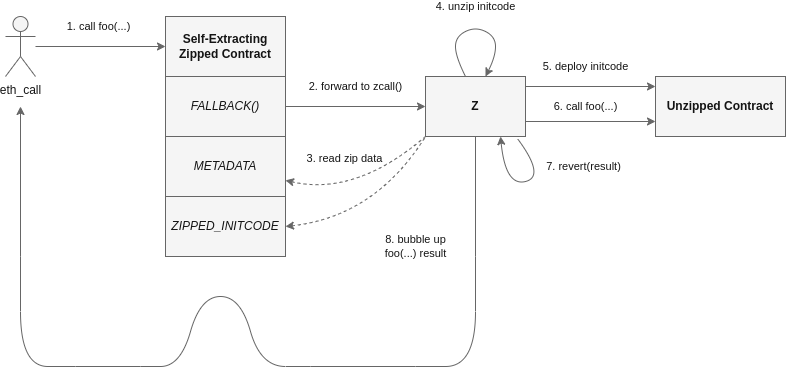

# ⛓ Zipped Contracts

Compressed contracts that automatically self-extract when called. Useful for cheaply deploying contracts that are always called off-chain in an `eth_call` context. There are many examples of these contracts used in modern protocols/dapps: "lens"-type helper contracts, quoters, NFT metadata, query helpers, etc.

## Installation (foundry)

```bash
$> forge install merklejerk/zipped-contracts
```

## Overview
Zipped contracts are essentially normal contracts that are compressed off-chain using [zlib DEFLATE](https://www.ietf.org/rfc/rfc1951.txt) then deployed on-chain inside of a self-extracting wrapper. Any call to the wrapper contract will trigger the wrapper's minimal fallback that forwards the call to the canonical `Z` runtime contract. The runtime contract decompresses the zipped contract, deploys it, then forwards the original call to the deployed instance. The result is bubbled up inside of a `revert()` payload to undo the deployment and avoid permanently modifying state.

All this witchcraft means that, from an `eth_call` context, interacting with a zipped contract is [very similar](#interacting-with-zipped-contracts) to any other contract!



## Case Studies
Most contracts can expect to see ~50% size/deployment cost reduction, and better for text-heavy applications. I applied this technology to some known off-chain contracts for comparison. No modifications were made to them and they still function as the original does.

| contract | current bytecode size | zipped bytecode size | savings/reduction |
|----------|-----------------------|----------------------|--------------------|
| Uniswap V3 Quoter          | [`4631`](https://goerli.etherscan.io/address/0xb27308f9F90D607463bb33eA1BeBb41C27CE5AB6) | [`2241`](https://goerli.etherscan.io/address/0x23206a7794369b2bf5e5c57d62566710b459776b) | 51% |
| [shields.build](https://shields.build) SVG Metadata | [`23732`](https://etherscan.io/address/0xfaDb4b43671Aa379D443Ffc4ec98d2aF2808eBe5) | [`8206`](https://goerli.etherscan.io/address/0xba04a9229af8ba43d9b4b23d9948c18a7fcc0083) | 65% |


## Interacting with Zipped Contracts
The self-extracting wrapper will perform the just-in-time decompression under the hood, so you can usually directly call a function on the zipped contract as if it were the unzipped contract. However, there are some things to be mindful of:

- Decompressing is a *very* expensive operation (upwards of 23M gas), so you should only call these contracts in the context of an `eth_call` where gas does not matter, i.e., not in a transaction that will be mined.
- Zipped contracts do not support `payable` functions.
- Off-chain helper and metadata contracts tend to have their functions written as read-only (`view` or `pure`). But since zipped contracts must be deployed just-in-time before the call can be made, top-level calls from another contract into the zipped contract cannot be made from inside a `staticcall()` context. You should cast the contract's interface to one with non-static functions to prevent the compiler from implictly generating a `staticcall()` when making calls.
- To emulate static guarantees of typical off-chain helper contracts, all zipped contracts will have their state changes undone by a revert on the top-level call. However, this only applies to the top-level call. Any calls beneath it that reenter the zipped contract can temporarily persist state, but will eventually be undone when the top-level call returns.
- Zipped contracts cannot have their source/ABI verified on etherscan at the moment. If you want users to be able to interact with zipped contracts through etherscan, consider deploying a minimal contract with the same interface that forwards calls to the zipped version ([example](https://sepolia.etherscan.io/address/0x174ac96bc1db901ee4016673f7a4adaa206d9d24#readContract)).

## ZCALL vs ZRUN Contracts
There are two types of zipped contracts supported by the runtime. The simpler, and probably more popular, choice is **ZCALL**, which follows the flow described earlier. The primary purpose of ZCALL contracts is to facilitate cheaper deployments. You usually don't have to do anything special to write ZCALL contracts; they often just work™.

**ZRUN** contracts, on the other-hand, are designed to bypass maximum bytecode size constraints. There is a well-known ~24KB bytecode size limit for deployable contracts on Ethereum that many projects bump into. ZRUN contracts artificially extend this ceiling, but to accomplish this, your contract must be written very deliberately:

1. You must perform all your logic inside the constructor.
2. You must manually ABI-encode and `return()` your return data in the constructor.

This means ZRUN contracts only have one entry-point/function, which is their constructor. They also cannot support callbacks (directly) because they will never have code at their deployed address.

## Deploying Zipped Contracts
There are foundry [scripts](./script/) and [examples](./script/sample) included in this repo that you can use to deploy your contracts as self-extracting zipped contracts.

If you add this repo as a foundry dependency (`forge install zipped-contracts`), you can inherit from `ZDeployBase` in your deploy script and let it handle deployment like so:

```solidity
import "zipped-contracts/script/ZDeployBase.sol";
import "src/MyContract.sol";

contract Deploy is ZDeployBase {
    function run() external {
        Z z = _getOrDeployZ();
        vm.startBroadcast();
        // Deploy as a ZCALL contract:
        _zcallDeploy(type(MyContract).creationCode, z);
        // or deploy as a ZRUN contract:
        _zrunDeploy(type(MyContract).creationCode, z);
    }
}
```

Note that the scripts in this repo require the `ffi=true` option in your `foundry.toml` and a `python3` to be accessible via `env`.

## Writing ZCALL Contracts

Most query-oriented contracts work out of the box as a ZCALL contract, with little to no modification. However, if your contract depends on the value of `msg.sender` or uses callbacks, there are some quirks to keep in mind.

### Addresses
`address(this)` will be the deterministic, temporary deployment address of your unzipped contract, which is different from the zipped contract address. If a call is made to your contract through the zipped contract, `msg.sender` will be the zipped contract address, and the original caller of the zipped contract will be appended to your calldata as a full word (32 bytes). You can call `isZippedContract()` on the `Z` runtime to detect if an address is your zipped contract:

```solidity
// Get the caller of the zipped contract.
address caller = Z.isZippedContract(msg.sender, address(this))
    ? abi.decode(msg.data[msg.data.length-32:], (address))
    : msg.sender;
}
```

### Callbacks and Reentrancy
You can reenter your unzipped contract either directly, via `this.xxx()`, or indirectly through the zipped contract's forwarder `ZIPPED_CONTRACT.xxx()`. But bear in mind the meaning of `msg.sender` in the latter case, as described previously.

### Delegatecalls
Yup, you can `delegatecall()` into a zipped contract and it will (eventually) delegatecall into the unzipped logic. ☺️

## Writing ZRUN Contracts

ZRUN contracts only have a single entry point and must be specially crafted to perform all their logic and explicitly return its result in its constructor. This can soften deployment bytecode size limits because only the result of the computation (not code) is deposited at the deployment address. The zipped version of your logic must still fit within the maximum deployment size, however.

### Addresses
`address(this)` will always be the deterministic, temporary deployment address of your unzipped contract, which is different from the zipped contract address. `msg.sender` will always be the zipped contract. You can recover the original caller of the zipped contract by decoding the last 32 bytes of your contract's initcode (accessible via `codecopy()` in assembly).

### `Z` Runtime Deployed Addresses
This is the canonical runtime for zipped contracts, which handles decompression, execution, and cleanup.
You probably won't need to interact with this contract directly if you're using the self-extracting wrapper.

### Callbacks and Reentrancy
ZRUN contracts cannot reenter or utilize callbacks because they run entirely inside of a constructor.

### ZRUN Example
Your ZRUN contract should explicitly `return()` its abi-encoded result in its constructor. You can call your own `internal`/`public` functions, but not `external` functions. From outside, calling *any* function on a zipped ZRUN contract will result in only the constructor being called.

```solidity
contract AddTwoNumbers {
    constructor(uint256 a, uint256 b) {
        uint256 c = a + b;
        bytes memory result = abi.encode(c);
        assembly { return(add(result, 0x20), mload(result)) }
    }

    // Dummy function to trigger the constructor. The body and name of this function does
    // not matter.
    function exec(uint256 a, uint256 b) external returns (uint256) {}
}

// ...
// Deploy and call the ZRUN contract.
// Prints "1337"
console.log(AddTwoNumbers(_zrunDeploy(type(AddTwoNumbers).creationCode)).exec(1300, 37));
```

## Deployed Addresses
These are the canonical runtime deployments. These will change with each subsequent release. Contracts deployed under older runtimes should continue to function without. You should try to interact only with the version your contract was deployed with.

| network | address |
|---------|---------|
| Ethereum mainnet | [`0xf1EeADEba1E05578d0e08635Fc7356aeDBEB33d1`](https://etherscan.io/address/0xf1EeADEba1E05578d0e08635Fc7356aeDBEB33d1) |
| Goerli           | [`0xcA64D4225804F2Ae069760CB5fF2F1D8BaC1C2f9`](https://goerli.etherscan.io/address/0xcA64D4225804F2Ae069760CB5fF2F1D8BaC1C2f9) |
| Sepolia          | [`0xcA64D4225804F2Ae069760CB5fF2F1D8BaC1C2f9`](https://sepolia.etherscan.io/address/0xcA64D4225804F2Ae069760CB5fF2F1D8BaC1C2f9) |

## Project Setup and Test

It's a foundry project. You know the drill.

```bash
$> git clone git@github.com:merklejerk/zipped-contracts.git && cd zipped-contracts
$> forge install
$> forge test -vvv
```

## Kudos
Thanks to [@adlerjohn](https://github.com/adlerjohn) for [inflate-sol](https://github.com/adlerjohn/inflate-sol), which is the basis for the decompression used here.